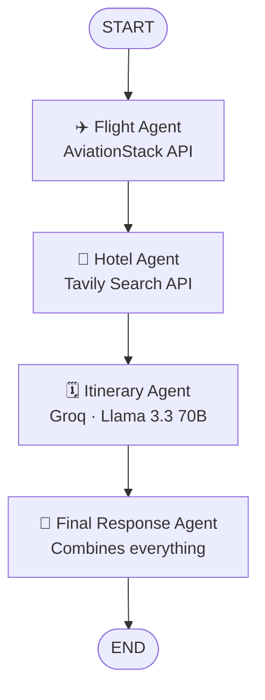

# ✈️ TravelLogic - Multi-Agent AI Travel Planning System with LangGraph

A **multi-agent AI travel planner** built with **LangGraph**, where four specialized agents collaborate — searching flights, searching hotels, building a day-by-day itinerary, and compiling everything into one final, ready-to-book travel plan. The system has long-term memory (PostgreSQL) and a polished **Streamlit** web interface.

---

## 📌 Overview

Planning a trip usually means juggling several tabs — flights, hotels, things to do, and a budget. This project automates that entire flow using a **graph of cooperating AI agents**, each responsible for one part of the trip, orchestrated by **LangGraph**.

Give it a single prompt like:

> "Plan a complete 7-day Japan trip including flights, hotels and sightseeing under ₹2 lakhs."

...and the system runs the flight agent → hotel agent → itinerary agent → final response agent in sequence, streaming each agent's progress live in the UI, and finally saves the generated plan as a downloadable Markdown file.

---

## 🧠 How It Works

Each agent updates a shared `TravelState` object as it moves through the graph, and a **PostgreSQL-backed checkpointer** persists the conversation state — so a user's travel history and context is remembered across sessions via a `thread_id` / User ID.

---

## ✨ Features

- ✈️ **Flight Search Agent** — real-time flight data via the AviationStack API
- 🏨 **Hotel Search Agent** — real-time hotel/travel info via the Tavily Search API
- 🗓️ **Itinerary Planning Agent** — generates a day-by-day plan using an LLM (Groq / Llama 3.3 70B)
- 🧠 **Final Response Agent** — merges all agent outputs into one cohesive, final travel plan
- 💾 **Long-term Memory** — PostgreSQL checkpointing keeps per-user conversation/session history
- 🌐 **Real-time API Integration** — no mock data, live results on every run
- 💻 **Streamlit Web App** — a dark-themed, modern UI with a live "agent pipeline" status view
- 📁 **Auto-saved Travel Plans** — every generated plan is saved as a Markdown file and is also downloadable from the UI

---

## 🛠️ Tech Stack

| Category | Technology |
|---|---|
| Agent Orchestration | [LangGraph](https://www.langchain.com/langgraph) |
| LLM Framework | [LangChain](https://www.langchain.com/) |
| LLM Provider | [Groq](https://console.groq.com/) — `llama-3.3-70b-versatile` |
| Memory / Persistence | PostgreSQL (`langgraph-checkpoint-postgres`) |
| Web Search | [Tavily API](https://tavily.com/) |
| Flight Data | [AviationStack API](https://aviationstack.com/) |
| Frontend | [Streamlit](https://streamlit.io/) |
| Language | Python 3.11 |

---

The app streams the flight agent, hotel agent, itinerary agent, and final agent's outputs live, then displays the completed plan and saves it as a timestamped `.md` file (also available via a **Download** button).
